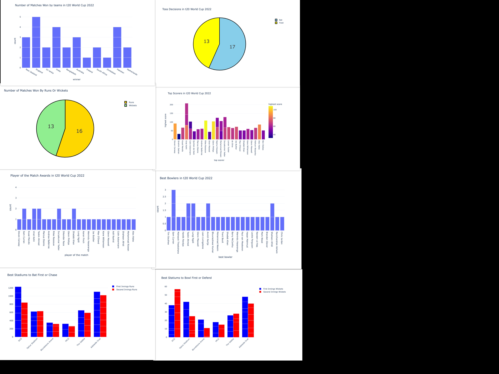

# T20-worldcup-2022-analysis

__Overview__
  
Welcome to this repository where i will do the data analysis of T20 World Cup 2022 stats using Python.

__Dataset__

The __[dataset](https://www.t20worldcup.com/)__ contains data about all the matches from the super 12 stage to the final of the **ICC Men's T20 World Cup 2022**.

__Needed Python Packages__

```
1.pandas
2.plotly
```

__DashBoard of all output__

Below image is the collection of all output in the code.
()

__Summary__

So some highlights of the t20 world cup 2022 we found from our analysis are:

1.**England** won the most number of matches.
2.**Virat Kohli** scored highest in the most number of matches.
3.**Sam Curran** was the best bowler in the most number of matches.
4.More teams won by **batting first**.
5.More teams decided to **bat first**.
6.**SCG** was the best stadium to **bat first**.
7.**SCG** was the best stadium to defend the target in the World Cup.
8.The **Optus** Stadium was the best stadium to **bowl first**.